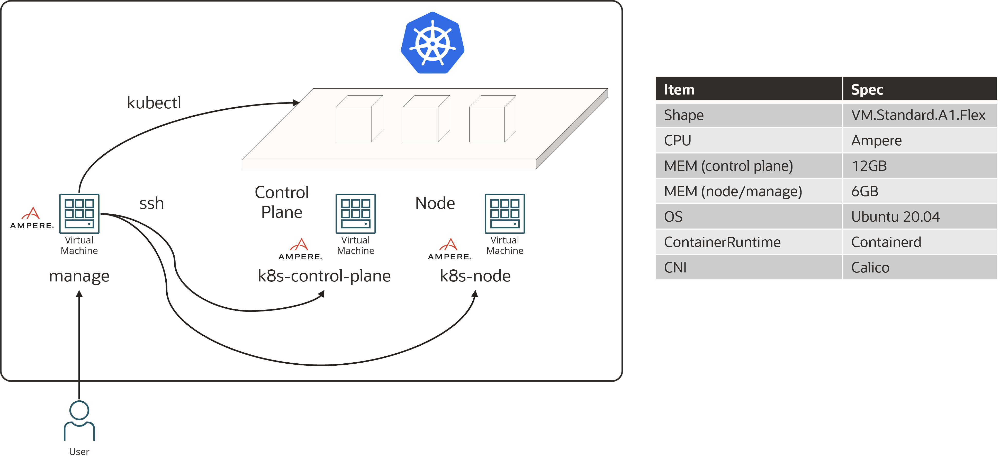
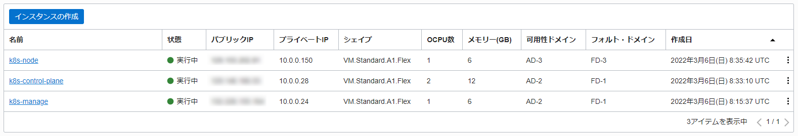

# ochacafe-s5-3
Ochacafe5 #3 Kubernetes Security

デモ環境の構築方法、資材置き場です。

# Kubernetes Cluster 構築

事前に以下のスペックで仮想マシンを作成して、SSHログイン可能な状態にしておきます。





VCNのセキュリティリストで「10.0.0.0/16」TCP 全てのプロトコルを許可しておきます。

以下手順は全てrootで行います。

## ControlPlane & Node 共通セットアップ

### netfilter セットアップ

```sh
modprobe br_netfilter
```

```sh
cat <<EOF > /etc/sysctl.d/k8s.conf
net.bridge.bridge-nf-call-ip6tables = 1
net.bridge.bridge-nf-call-iptables = 1
EOF
```

```sh
sysctl --system
```

### iptables セットアップ

```sh
vim /etc/iptables/rules.v4
```

以下追加

```sh
-A INPUT -p tcp -m state --state NEW -m tcp --dport 80 -j ACCEPT
-A INPUT -p tcp -m state --state NEW -m tcp --dport 443 -j ACCEPT
-A INPUT -p tcp -m state --state NEW -m tcp --dport 6443 -j ACCEPT
-A INPUT -p tcp -m state --state NEW -m tcp --dport 2379 -j ACCEPT
-A INPUT -p tcp -m state --state NEW -m tcp --dport 2380 -j ACCEPT
-A INPUT -p tcp -m state --state NEW -m tcp --dport 10250 -j ACCEPT
-A INPUT -p tcp -m state --state NEW -m tcp --dport 10251 -j ACCEPT
-A INPUT -p tcp -m state --state NEW -m tcp --dport 10252 -j ACCEPT
-A INPUT -p tcp -m state --state NEW -m tcp --dport 6443 -j ACCEPT
-A INPUT -p tcp -m state --state NEW -m tcp --match multiport --dports 30000:32767 -j ACCEPT
```

以下削除

```sh
-A INPUT -j REJECT --reject-with icmp-host-prohibited
-A FORWARD -j REJECT --reject-with icmp-host-prohibited
```

ルール適用

```sh
iptables-restore < /etc/iptables/rules.v4
```

### containerd セットアップ

```sh
cat > /etc/modules-load.d/containerd.conf <<EOF
overlay
br_netfilter
EOF
```

```sh
modprobe overlay
```

```sh
modprobe br_netfilter
```

```sh
cat > /etc/sysctl.d/99-kubernetes-cri.conf <<EOF
net.bridge.bridge-nf-call-iptables  = 1
net.ipv4.ip_forward                 = 1
net.bridge.bridge-nf-call-ip6tables = 1
EOF
```

```sh
sysctl --system
```

```sh
apt-get update && apt-get install -y apt-transport-https ca-certificates curl software-properties-common
```

```sh
curl -fsSL https://download.docker.com/linux/ubuntu/gpg | apt-key add -
```

```sh
add-apt-repository \
    "deb [arch=amd64] https://download.docker.com/linux/ubuntu \
    $(lsb_release -cs) \
    stable"
```

```sh
apt-get update && apt-get install -y containerd
```

```sh
mkdir -p /etc/containerd
```

```sh
containerd config default | sudo tee /etc/containerd/config.toml
```

### kubeadm、kubelet、kubectl インストール

```sh
curl -s https://packages.cloud.google.com/apt/doc/apt-key.gpg | sudo apt-key add -
```

```sh
cat <<EOF | sudo tee /etc/apt/sources.list.d/kubernetes.list
deb https://apt.kubernetes.io/ kubernetes-xenial main
EOF
```

```sh
apt-get update
```

```sh
apt-get install -y kubelet kubeadm kubectl
```

```sh
apt-mark hold kubelet kubeadm kubectl
```

```sh
systemctl daemon-reload
```

```sh
systemctl restart kubelet
```

## ControlPlane セットアップ

### Kubernetes Cluster Initial

```sh
kubeadm init --pod-network-cidr=192.168.0.0/16
```

以下コマンドをNodeセットアップ完了後にNodeで実施するので、
テキストエディタ等にコマンドを保存。

```sh
kubeadm join ***.***.***.***:6443 --token xxxxxxxxxxxxxxxxxxxxxxxx --discovery-token-ca-cert-hash sha256:xxxxxxxxxxxxxxxxxxxxxxxxxxxxxxxxxxxxxxxxxxxxxxxx
```

### kubeconfig セットアップ

Control Planeで実施

```sh
mkdir -p $HOME/.kube
```

```sh
cp -i /etc/kubernetes/admin.conf $HOME/.kube/config
```

```sh
chown $(id -u):$(id -g) $HOME/.kube/config
```

### Calico インストール

Control Planeで実施

```sh
kubectl create -f https://docs.projectcalico.org/manifests/tigera-operator.yaml
```

```sh
kubectl create -f https://docs.projectcalico.org/manifests/custom-resources.yaml
```

```sh
kubectl get nodes
```

```sh
NAME                         STATUS   ROLES                  AGE     VERSION
k8s-control-plane            Ready    control-plane,master   3m34s   v1.23.4
```

## Node セットアップ

```sh
sudo -i
```

```sh
kubeadm join ***.***.***.***:6443 --token xxxxxxxxxxxxxxxxxxxxxxxx --discovery-token-ca-cert-hash sha256:xxxxxxxxxxxxxxxxxxxxxxxxxxxxxxxxxxxxxxxxxxxxxxxx
```

ControlPlaneまたはManage Server（kubectlセットアップ後）で以下コマンドを実施

```sh
kubectl get nodes
```

```sh
NAME                         STATUS   ROLES                  AGE     VERSION
k8s-control-plane            Ready    control-plane,master   18m     v1.23.4
k8s-node                     Ready    <none>                 4m44s   v1.23.4
```

## Manage Server セットアップ

```sh
sudo -i
```

### kubectl インストール

```sh
curl -LO "https://dl.k8s.io/release/$(curl -L -s https://dl.k8s.io/release/stable.txt)/bin/linux/arm64/kubectl"
```

```sh
chmod +x ./kubectl
```

```sh
mv ./kubectl /usr/local/bin/kubectl
```

```sh
kubectl version --client
```

```sh
mkdir -p $HOME/.kube
```

事前にControlePlaneでkubeconfigを取得しておく

```sh
vim $HOME/.kube/config
```

```sh
kubectl get nodes
```

```sh
NAME                         STATUS   ROLES                  AGE     VERSION
k8s-control-plane            Ready    control-plane,master   18m     v1.23.4
k8s-node                     Ready    <none>                 4m44s   v1.23.4
```

### リポジトリから資材のクローン

```sh
git clone https://github.com/oracle-japan/ochacafe-s5-3.git
```

# Kubernetes Security - Cluster Setup -

## NetworkPolicy

### 1.全ての送信トラフィックを許可、受信トラフィックは拒否

#### サンプルPodとNamespaceの作成

```sh
kubectl apply -f ochacafe-s5-3/networkpolicy/sample-pod.yaml
```
```sh
pod/sample-pod-1 created
pod/sample-pod-2 created
namespace/test created
pod/sample-pod-3 created
pod/sample-pod-4 created
```

```sh
kubectl get pods
```
```sh
NAME           READY   STATUS    RESTARTS   AGE
sample-pod-1   1/1     Running   0          108s
sample-pod-2   1/1     Running   0          108s
```

```sh
kubectl get pods -n test
```
```sh
NAME           READY   STATUS    RESTARTS   AGE
sample-pod-3   1/1     Running   0          2m19s
sample-pod-4   1/1     Running   0          2m19s
```

```sh
kubectl get namespaces
```
```sh
NAME               STATUS   AGE
calico-apiserver   Active   71m
calico-system      Active   72m
default            Active   74m
kube-node-lease    Active   74m
kube-public        Active   74m
kube-system        Active   74m
test               Active   2m58s
tigera-operator    Active   72m
```

#### Namespace「default」と「test」に「egress-only-allow-networkpoplicy.yaml」を適用

```sh
kubectl apply -f ochacafe-s5-3/networkpolicy/egress-only-allow-networkpolicy.yaml
```
```sh
networkpolicy.networking.k8s.io/egress-only-allow-networkpolicy created
```

```sh
kubectl apply -f ochacafe-s5-3/networkpolicy/egress-only-allow-networkpolicy.yaml -n test
```
```sh
networkpolicy.networking.k8s.io/egress-only-allow-networkpolicy created
```

各Podの状況確認

```sh
kubectl get pod -o wide
```
```sh
NAME           READY   STATUS    RESTARTS   AGE   IP                NODE              NOMINATED NODE   READINESS GATES
sample-pod-1   1/1     Running   0          13m   192.168.173.129   k8s-node-517516   <none>           <none>
sample-pod-2   1/1     Running   0          13m   192.168.173.130   k8s-node-517516   <none>           <none>
```

```sh
kubectl get pod -o wide -n test
```
```sh
NAME           READY   STATUS    RESTARTS   AGE   IP                NODE              NOMINATED NODE   READINESS GATES
sample-pod-3   1/1     Running   0          14m   192.168.173.132   k8s-node-517516   <none>           <none>
sample-pod-4   1/1     Running   0          14m   192.168.173.131   k8s-node-517516   <none>           <none>
```

※ローカルIPは自動で割り振られるため上記と異なる場合はご自身の環境に合わせてください

この状態で、「sample-pod-1」から他のPodへのアクセスは不可

```sh
kubectl exec -it sample-pod-1 -- /bin/bash
```
```sh
curl 192.168.173.130
```
```sh
curl 192.168.173.132
```
```sh
curl 192.168.173.131
```

「sample-pod-1」からexit

```sh
exit
```

### 2.「app: pod1」から「app: pod2」のみ受信許可

#### 「sp-pod-allow-networkpolicy.yaml」を適用

```sh
kubectl apply -f ochacafe-s5-3/networkpolicy/sp-pod-allow-networkpolicy.yaml
```
```sh
networkpolicy.networking.k8s.io/sp-pod-allow-networkpolicy created
```

#### 「sample-pod-1」から「sample-pod-2」へのアクセスは可、他のPodへのアクセスは不可

```sh
kubectl exec -it sample-pod-1 -- /bin/bash
```
```sh
curl 192.168.173.130
<!DOCTYPE html>
<html>
<head>
<title>Welcome to nginx!</title>
<style>
html { color-scheme: light dark; }
body { width: 35em; margin: 0 auto;
font-family: Tahoma, Verdana, Arial, sans-serif; }
</style>
</head>
<body>
<h1>Welcome to nginx!</h1>
<p>If you see this page, the nginx web server is successfully installed and
working. Further configuration is required.</p>

<p>For online documentation and support please refer to
<a href="http://nginx.org/">nginx.org</a>.<br/>
Commercial support is available at
<a href="http://nginx.com/">nginx.com</a>.</p>

<p><em>Thank you for using nginx.</em></p>
</body>
</html>
```
```sh
curl 192.168.173.132
```
```sh
curl 192.168.173.131
```

「sample-pod-1」からexit

```sh
exit
```

### 3.Namespace defaultのPodから「app: pod3」のみ受信許可

#### 「sp-namespace-allow-networkpolicy.yaml」の適用

```sh
kubectl apply -f ochacafe-s5-3/networkpolicy/sp-namespace-allow-networkpolicy.yaml
```
```sh
networkpolicy.networking.k8s.io/sp-namespace-allow-networkpolicy created
```

#### 「sample-pod-1」から「sample-pod-2」から、「sample-pod-3」へのアクセスは可、「sample-pod-4」へのアクセスは不可

```sh
kubectl exec -it sample-pod-1 -- /bin/bash
```
```sh
curl 192.168.173.132
```
```sh
<!DOCTYPE html>
<html>
<head>
<title>Welcome to nginx!</title>
<style>
html { color-scheme: light dark; }
body { width: 35em; margin: 0 auto;
font-family: Tahoma, Verdana, Arial, sans-serif; }
</style>
</head>
<body>
<h1>Welcome to nginx!</h1>
<p>If you see this page, the nginx web server is successfully installed and
working. Further configuration is required.</p>

<p>For online documentation and support please refer to
<a href="http://nginx.org/">nginx.org</a>.<br/>
Commercial support is available at
<a href="http://nginx.com/">nginx.com</a>.</p>

<p><em>Thank you for using nginx.</em></p>
</body>
</html>
```
```sh
curl 192.168.173.131
```

「sample-pod-1」からexit

```sh
exit
```

```sh
kubectl exec -it sample-pod-2 -- /bin/bash
```
```sh
curl 192.168.173.132
```
```sh
<!DOCTYPE html>
<html>
<head>
<title>Welcome to nginx!</title>
<style>
html { color-scheme: light dark; }
body { width: 35em; margin: 0 auto;
font-family: Tahoma, Verdana, Arial, sans-serif; }
</style>
</head>
<body>
<h1>Welcome to nginx!</h1>
<p>If you see this page, the nginx web server is successfully installed and
working. Further configuration is required.</p>

<p>For online documentation and support please refer to
<a href="http://nginx.org/">nginx.org</a>.<br/>
Commercial support is available at
<a href="http://nginx.com/">nginx.com</a>.</p>

<p><em>Thank you for using nginx.</em></p>
</body>
</html>
```

```sh
curl 192.168.173.131
```

「sample-pod-2」からexit

```sh
exit
```

NetworkPolicyの削除

```sh
kubectl delete -f ochacafe-s5-3/networkpolicy/sp-namespace-allow-networkpolicy.yaml
```
```sh
networkpolicy.networking.k8s.io/sp-namespace-allow-networkpolicy delete
```

### 4. 特定のIP Podから「app: pod3」のみ受信許可

#### 「sp-ip-allow-networkpolicy.yaml」の適用

```sh
kubectl apply -f ochacafe-s5-3/networkpolicy/sp-ip-allow-networkpolicy.yaml
```
```sh
networkpolicy.networking.k8s.io/sp-ip-allow-networkpolicy created
```

#### 「sample-pod-2」からのみ、「sample-pod-3」へのアクセスは可、それ以外へのアクセスは不可

```sh
kubectl exec -it sample-pod-1 -- /bin/bash
```
```sh
curl 192.168.173.132
```
```sh
curl 192.168.173.131
```

「sample-pod-1」からexit

```sh
exit
```

```sh
kubectl exec -it sample-pod-2 -- /bin/bash
```
```sh
curl 192.168.173.132
```
```sh
<!DOCTYPE html>
<html>
<head>
<title>Welcome to nginx!</title>
<style>
html { color-scheme: light dark; }
body { width: 35em; margin: 0 auto;
font-family: Tahoma, Verdana, Arial, sans-serif; }
</style>
</head>
<body>
<h1>Welcome to nginx!</h1>
<p>If you see this page, the nginx web server is successfully installed and
working. Further configuration is required.</p>

<p>For online documentation and support please refer to
<a href="http://nginx.org/">nginx.org</a>.<br/>
Commercial support is available at
<a href="http://nginx.com/">nginx.com</a>.</p>

<p><em>Thank you for using nginx.</em></p>
</body>
</html>
```
```sh
curl 192.168.173.131
```

「sample-pod-2」からexit

```sh
exit
```

#### 適用したNetwork PolicyとサンプルPodを削除

Network Policyの削除

```sh
kubectl delete -f ochacafe-s5-3/networkpolicy/sp-ip-allow-networkpolicy.yaml
```
```sh
networkpolicy.networking.k8s.io "sp-ip-allow-networkpolicy" deleted
```

```sh
kubectl delete -f ochacafe-s5-3/networkpolicy/sp-pod-allow-networkpolicy.yaml
```
```sh
networkpolicy.networking.k8s.io "sp-pod-allow-networkpolicy" deleted
```

```sh
kubectl delete -f ochacafe-s5-3/networkpolicy/egress-only-allow-networkpolicy.yaml
```
```sh
networkpolicy.networking.k8s.io "egress-only-allow-networkpolicy" deleted
```

```sh
kubectl delete -f ochacafe-s5-3/networkpolicy/egress-only-allow-networkpolicy.yaml -n test
```
```sh
networkpolicy.networking.k8s.io "egress-only-allow-networkpolicy" deleted
```

```sh
kubectl get networkpolicy --all-namespaces
```
```sh
NAMESPACE          NAME              POD-SELECTOR     AGE
calico-apiserver   allow-apiserver   apiserver=true   149m
```

サンプルPodの削除

```sh
kubectl delete -f ochacafe-s5-3/networkpolicy/sample-pod.yaml
```

## CIS Benchmark

### 1.「job-master.yaml」の作成

```sh
cat ochacafe-s5-3/kube-bench/job-master.yaml
```
```sh
apiVersion: batch/v1
kind: Job
metadata:
  name: kube-bench-master
spec:
  template:
    spec:
      hostPID: true
      nodeSelector:
        node-role.kubernetes.io/master: ""
      tolerations:
        - key: node-role.kubernetes.io/master
          operator: Exists
          effect: NoSchedule
      containers:
        - name: kube-bench
          image: aquasec/kube-bench:latest
          #command: ["kube-bench", "run", "--targets", "master"]
          command: ["kube-bench"] #変更
          args: ["--version=1.23"] #追加
          volumeMounts:
            - name: var-lib-etcd
              mountPath: /var/lib/etcd
              readOnly: true
            - name: var-lib-kubelet
              mountPath: /var/lib/kubelet
              readOnly: true
            - name: var-lib-kube-scheduler
              mountPath: /var/lib/kube-scheduler
              readOnly: true
            - name: var-lib-kube-controller-manager
              mountPath: /var/lib/kube-controller-manager
              readOnly: true
            - name: etc-systemd
              mountPath: /etc/systemd
              readOnly: true
            - name: lib-systemd
              mountPath: /lib/systemd/
              readOnly: true
            - name: srv-kubernetes
              mountPath: /srv/kubernetes/
              readOnly: true
            - name: etc-kubernetes
              mountPath: /etc/kubernetes
              readOnly: true
              # /usr/local/mount-from-host/bin is mounted to access kubectl / kubelet, for auto-detecting the Kubernetes version.
              # You can omit this mount if you specify --version as part of the command.
            - name: usr-bin
              mountPath: /usr/local/mount-from-host/bin
              readOnly: true
            - name: etc-cni-netd
              mountPath: /etc/cni/net.d/
              readOnly: true
            - name: opt-cni-bin
              mountPath: /opt/cni/bin/
              readOnly: true
            - name: etc-passwd
              mountPath: /etc/passwd
              readOnly: true
            - name: etc-group
              mountPath: /etc/group
              readOnly: true
      restartPolicy: Never
      volumes:
        - name: var-lib-etcd
          hostPath:
            path: "/var/lib/etcd"
        - name: var-lib-kubelet
          hostPath:
            path: "/var/lib/kubelet"
        - name: var-lib-kube-scheduler
          hostPath:
            path: "/var/lib/kube-scheduler"
        - name: var-lib-kube-controller-manager
          hostPath:
            path: "/var/lib/kube-controller-manager"
        - name: etc-systemd
          hostPath:
            path: "/etc/systemd"
        - name: lib-systemd
          hostPath:
            path: "/lib/systemd"
        - name: srv-kubernetes
          hostPath:
            path: "/srv/kubernetes"
        - name: etc-kubernetes
          hostPath:
            path: "/etc/kubernetes"
        - name: usr-bin
          hostPath:
            path: "/usr/bin"
        - name: etc-cni-netd
          hostPath:
            path: "/etc/cni/net.d/"
        - name: opt-cni-bin
          hostPath:
            path: "/opt/cni/bin/"
        - name: etc-passwd
          hostPath:
            path: "/etc/passwd"
        - name: etc-group
          hostPath:
            path: "/etc/group"
```

### 2. kube-bench の実行

「job-master.yaml」の適用

```sh
kubectl apply -f ochacafe-s5-3/kube-bench/job-master.yaml
```
```sh
job.batch/kube-bench-master created
```

「kube-bench-master」PodのSTATUSがCompletedになるまで待つ。

```sh
kubectl get pods
```
```sh
NAME                      READY   STATUS      RESTARTS   AGE
kube-bench-master-64mwj   0/1     Completed   0          40s
```

### 3. 結果の確認

CompletedしたPodのログを確認

```sh
kubectl logs kube-bench-master-64mwj
```
```sh
・
・（省略）
・
== Remediations master ==
・
・（省略）
・
1.2.15 Follow the documentation and create Pod Security Policy objects as per your environment.
Then, edit the API server pod specification file /etc/kubernetes/manifests/kube-apiserver.yaml
on the master node and set the --enable-admission-plugins parameter to a
value that includes PodSecurityPolicy:
--enable-admission-plugins=...,PodSecurityPolicy,...
Then restart the API Server.
・
・（省略）
・
== Summary master ==
42 checks PASS
11 checks FAIL
11 checks WARN
0 checks INFO
・
・（省略）
・
== Summary etcd ==
7 checks PASS
0 checks FAIL
0 checks WARN
0 checks INFO
・
・（省略）
・
== Summary controlplane ==
0 checks PASS
0 checks FAIL
3 checks WARN
0 checks INFO
・
・（省略）
・
== Summary node ==
19 checks PASS
1 checks FAIL
3 checks WARN
0 checks INFO
・
・（省略）
・
== Summary policies ==
0 checks PASS
0 checks FAIL
26 checks WARN
0 checks INFO

== Summary total ==
68 checks PASS
12 checks FAIL
43 checks WARN
0 checks INFO
```

```sh
kubectl delete -f ochacafe-s5-3/kube-bench/job-master.yaml
```
```sh
job.batch "kube-bench-master" deleted
```

# Kubernetes Security - Cluster Hardening -

## RBAC

### 1.roleとrolebinding(k8s-manage)

#### 「pod-sa」というServiceAccountを作成

```sh
kubectl create serviceaccount pod-sa
```
```sh
serviceaccount/pod-sa created
```

```sh
kubectl get serviceaccounts
```
```sh
NAME      SECRETS   AGE
default   1         3h28m
pod-sa    1         9s
```

#### 「pod-role」というroleを作成

```sh
kubectl create role pod-role --resource pods --verb list -o yaml --dry-run=client > pod-role.yaml
```

```sh
cat pod-role.yaml
```
```sh
apiVersion: rbac.authorization.k8s.io/v1
kind: Role
metadata:
  creationTimestamp: null
  name: pod-role
rules:
- apiGroups:
  - ""
  resources:
  - pods
  verbs:
  - list
```

```sh
kubectl apply -f pod-role.yaml
```
```sh
role.rbac.authorization.k8s.io/pod-role created
```

```sh
kubectl get roles
```
```sh
NAME       CREATED AT
pod-role   2022-03-02T08:15:22Z
```

#### 「pod-rolebinding」というrolebindingの作成及び「pod-sa」というServiceAccountと紐づける

ServiceAccout pod-saでは、defaultのNamespaceでPodの一覧のみ取得が許可されているので、Podを作成しようとするとエラーとなる。

```sh
kubectl create rolebinding pod-rolebinding --role pod-role --serviceaccount default:pod-sa -o yaml --dry-run=client > pod-rolebinding.yaml
```

```sh
cat pod-rolebinding.yaml
```
```sh
apiVersion: rbac.authorization.k8s.io/v1
kind: RoleBinding
metadata:
  creationTimestamp: null
  name: pod-rolebinding
roleRef:
  apiGroup: rbac.authorization.k8s.io
  kind: Role
  name: pod-role
subjects:
- kind: ServiceAccount
  name: pod-sa
  namespace: default
```

```sh
kubectl apply -f pod-rolebinding.yaml
```
```sh
rolebinding.rbac.authorization.k8s.io/pod-rolebinding created
```

```sh
kubectl get rolebindings
```
```sh
NAME              ROLE            AGE
pod-rolebinding   Role/pod-role   45s
```

Podの一覧を取得

```sh
kubectl --as=system:serviceaccount:default:pod-sa get pods
```
```sh
No resources found in default namespace.
```

Podを作成しようと試みる

```sh
kubectl --as=system:serviceaccount:default:pod-sa run nginx --image=nginx
```
```sh
Error from server (Forbidden): pods is forbidden: User "system:serviceaccount:default:pod-sa" cannot create resource "pods" in API group "" in the namespace "default"
```

### 2.clusterroleとclusterrolebinding(k8s-manage)

#### 「namespace-sa」というServiceAccountを作成

```sh
kubectl create serviceaccount namespace-sa
```
```sh
serviceaccount/namespace-sa created
```

```sh
kubectl get serviceaccounts
```
```sh
NAME           SECRETS   AGE
default        1         4h
namespace-sa   1         9s
pod-sa         1         32m
```

#### 「namespace-clusterrole」というclusterroleを作成

```sh
kubectl create clusterrole namespace-clusterrole --resource namespaces --verb list -o yaml --dry-run=client > namespace-clusterrole.yaml
```

```sh
cat namespace-clusterrole.yaml
```
```sh
apiVersion: rbac.authorization.k8s.io/v1
kind: ClusterRole
metadata:
  creationTimestamp: null
  name: namespace-clusterrole
rules:
- apiGroups:
  - ""
  resources:
  - namespaces
  verbs:
  - list
```

```sh
kubectl apply -f namespace-clusterrole.yaml
```
```sh
clusterrole.rbac.authorization.k8s.io/namespace-clusterrole created
```

```sh
kubectl get clusterroles | grep namespace-clusterrole
```
```sh
namespace-clusterrole                                                  2022-03-02T08:49:55Z
```

#### 「namespace-clusterrolebinding」というclusterrolebindingの作成及び「namespace-sa」というServiceAccountと紐づける

ServiceAccout namespace-saでは、defaultのNamespaceでNamespaceの一覧のみ取得が許可されているので、Namespaceを作成しようとするとエラーとなる。

```sh
kubectl create clusterrolebinding namespace-clusterrolebinding --clusterrole namespace-clusterrole --serviceaccount default:namespace-sa -o yaml --dry-run=client > namespace-clusterrolebinding.yaml
```

```sh
cat namespace-clusterrolebinding.yaml
```
```sh
apiVersion: rbac.authorization.k8s.io/v1
kind: ClusterRoleBinding
metadata:
  creationTimestamp: null
  name: namespace-clusterrolebinding
roleRef:
  apiGroup: rbac.authorization.k8s.io
  kind: ClusterRole
  name: namespace-clusterrole
subjects:
- kind: ServiceAccount
  name: namespace-sa
  namespace: default
```

```sh
kubectl apply -f namespace-clusterrolebinding.yaml
```
```sh
clusterrolebinding.rbac.authorization.k8s.io/namespace-clusterrolebinding created
```

```sh
kubectl get clusterrolebindings | grep namespace-clusterrolebinding
```
```sh
namespace-clusterrolebinding                           ClusterRole/namespace-clusterrole                                                  45s
```

Namespaceの一覧を取得

```sh
kubectl --as=system:serviceaccount:default:namespace-sa get namespaces
```
```sh
NAME               STATUS   AGE
calico-apiserver   Active   4h15m
calico-system      Active   4h16m
default            Active   4h18m
kube-node-lease    Active   4h18m
kube-public        Active   4h18m
kube-system        Active   4h18m
tigera-operator    Active   4h16m
```

Namespaceを作成しようと試みる

```sh
kubectl --as=system:serviceaccount:default:namespace-sa create namespace mynamespace
```
```sh
Error from server (Forbidden): namespaces is forbidden: User "system:serviceaccount:default:namespace-sa" cannot create resource "namespaces" in API group "" at the cluster scope
```

# Kubernetes Security - System Hardening -

## AppArmor

### 1.Nodeに接続して、apparmorが有効か確認(k8s-node)

「Y」と表示されれば有効状態

```sh
cat /sys/module/apparmor/parameters/enabled
```
```sh
Y
```

### 2.Nodeに接続して、以下のAppArmor Profileを作成(k8s-node)

ファイル書き込みを拒否するAppArmor Profileを作成

```sh
vim /etc/apparmor.d/k8s-apparmor-example-deny-write
```
```sh
#include <tunables/global>

profile k8s-apparmor-example-deny-write flags=(attach_disconnected) {
  #include <abstractions/base>

  file,

  # Deny all file writes.
  deny /** w,
}
```

### 3.apparmor_parserコマンドを実行して、AppArmorプロファイルを登録(k8s-node)

```sh
apparmor_parser -q /etc/apparmor.d/k8s-apparmor-example-deny-write
```

```sh
aa-status | grep k8s-apparmor-example-deny-write
```
```sh
   k8s-apparmor-example-deny-write
   /usr/bin/sleep (92896) k8s-apparmor-example-deny-write
```

Nodeからexit

```sh
exit
```
```sh
logout
```
```sh
exit
```
```sh
logout
Connection to 144.21.***.*** closed.
```

### 4.AppArmor Profileのアノテーションを定義したマニフェストの作成(k8s-manage)

```sh
cat ochacafe-s5-3/apparomor/hello-apparomor.yaml
```
```sh
apiVersion: v1
kind: Pod
metadata:
  name: hello-apparmor
  annotations:
    # Tell Kubernetes to apply the AppArmor profile "k8s-apparmor-example-deny-write".
    # Note that this is ignored if the Kubernetes node is not running version 1.4 or greater.
    container.apparmor.security.beta.kubernetes.io/hello: localhost/k8s-apparmor-example-deny-write
spec:
  containers:
  - name: hello
    image: busybox
    command: [ "sh", "-c", "echo 'Hello AppArmor!' && sleep 1h" ]
```

### 5.マニフェスト適用(k8s-manage)

```sh
kubectl apply -f ochacafe-s5-3/apparmor/hello-apparmor.yaml
```
```sh
pod/hello-apparmor created
```

```sh
kubectl get pods
```
```sh
NAME                      READY   STATUS      RESTARTS   AGE
hello-apparmor            1/1     Running     0          26s
```

コンテナがこのプロファイルで実際に実行されていることを確認するために、コンテナのproc attrをチェック。

```sh
kubectl exec hello-apparmor -- cat /proc/1/attr/current
```
```sh
k8s-apparmor-example-deny-write (enforce)
```

### 6.ファイルを書き込みによる動作確認(k8s-manage)

起動したPodからファイルを作成してエラーとなることを確認

```sh
kubectl exec hello-apparmor -- touch /tmp/test
```
```sh
touch: /tmp/file: Permission denied
command terminated with exit code 1
```

※プロファイルをannotationに設定せずに起動した場合は、「/tmp/test」は作成される

```sh
kubectl delete -f ochacafe-s5-3/apparmor/hello-apparmor.yaml
```
```sh
pod "hello-apparmor" deleted
```

## Seccomp

### 1.Nodeに接続して、seccompが有効か確認(k8s-node)

「CONFIG_SECCOMP=y」と表示されれば有効状態

```sh
grep CONFIG_SECCOMP= /boot/config-$(uname -r)
```
```sh
CONFIG_SECCOMP=y
```

### 2.seccompのprofileを作成(k8s-node)

専用ディレクトリを作成

```sh
mkdir -p /var/lib/kubelet/seccomp/profiles
```

プロファイルを作成

```sh
vim /var/lib/kubelet/seccomp/profiles/prohibit-mkdir.json
```
```sh
{
  "defaultAction": "SCMP_ACT_ALLOW",
  "syscalls": [
    {
      "names": ["mkdir","mkdirat"],
      "action": "SCMP_ACT_ERRNO"
    }
  ]
}
```

Nodeからexit

```sh
exit
```
```sh
logout
```
```sh
exit
```
```sh
logout
Connection to 144.21.***.*** closed.
```

### 3.Profileを指定したマニフェストを作成(k8s-manage)

```sh
cat ochacafe-s5-3/seccomp/prohibit-mkdir.yaml
```
```sh
apiVersion: v1
kind: Pod
metadata:
  name: prohibit-mkdir
spec:
  securityContext:
    seccompProfile:
      type: Localhost
      localhostProfile: profiles/prohibit-mkdir.json
  containers:
    - name: ubuntu
      image: ubuntu:21.10
      command:
        - sleep
        - infinity
```

### 4.マニフェストを適用(k8s-manage)

```sh
kubectl apply -f ochacafe-s5-3/seccomp/prohibit-mkdir.yaml
```
```sh
pod/prohibit-mkdir created
```

```sh
kubectl get pods
```
```sh
NAME                      READY   STATUS      RESTARTS   AGE
prohibit-mkdir            1/1     Running     0          16s
```

### 5.挙動確認(k8s-manage)

ディレクトリを作成を試みるがエラーとなる。

```sh
kubectl exec -it prohibit-mkdir -- mkdir test
```
```sh
mkdir: cannot create directory 'test': Operation not permitted
command terminated with exit code 1
```

```sh
kubectl delete -f ochacafe-s5-3/seccomp/prohibit-mkdir.yaml
```
```sh
pod "prohibit-mkdir" deleted
```

# Kubernetes Security - Minimize Microservice Vulnerabilities -

## SecurityContext

(k8s-manage)

```sh
cat ochacafe-s5-3/securitycontext/container-sc.yaml
```
```sh
apiVersion: v1
kind: Pod
metadata:
  name: container-sc
spec:
  containers:
  - name: nginx-container
    image: nginx:1.21
    securityContext:
      runAsNonRoot: true
```

```sh
kubectl apply -f ochacafe-s5-3/securitycontext/container-sc.yaml
```
```sh
pod/container-sc created
```

```sh
cat ochacafe-s5-3/securitycontext/pod-sc.yaml
```
```sh
apiVersion: v1
kind: Pod
metadata:
  name: pod-sc
spec:
  securityContext:
    runAsNonRoot: true
  containers:
  - name: nginx-container
    image: nginx:1.21
```

```sh
kubectl apply -f ochacafe-s5-3/securitycontext/pod-sc.yaml
```
```sh
pod/pod-sc created
```

どちらとも結果としては、runAsNonRootによりNginx Podは作成されない。

```sh
kubectl get pods
```
```sh
NAME                      READY   STATUS                       RESTARTS   AGE
container-sc              0/1     CreateContainerConfigError   0          62s
pod-sc                    0/1     CreateContainerConfigError   0          23s
```

両方に設定した場合は、「spec.containers.securityContext」が優先される。

```sh
cat ochacafe-s5-3/securitycontext/both-test.yaml
```
```sh
apiVersion: v1
kind: Pod
metadata:
  name: both-test
spec:
  securityContext:
    runAsUser: 1000
  containers:
  - name: ubuntu
    image: ubuntu:21.10
    securityContext:
      runAsUser: 1001
    command:
      - sleep
      - infinity
```

```sh
kubectl apply -f ochacafe-s5-3/securitycontext/both-test.yaml
```
```sh
pod/both-test created
```

「spec.containers.securityContext.runAsUser」が適用されているが確認できる。

```sh
kubectl exec both-test -- id
```
```sh
uid=1001 gid=0(root) groups=0(root)
```

```sh
kubectl delete -f ochacafe-s5-3/securitycontext/container-sc.yaml
```
```sh
pod "container-sc" deleted
```

```sh
kubectl delete -f ochacafe-s5-3/securitycontext/pod-sc.yaml
```
```sh
pod "pod-sc" deleted
```

```sh
kubectl delete -f ochacafe-s5-3/securitycontext/both-test.yaml
```
```sh
pod "both-test" deleted
```

### 事前準備

### 1.kube-apiserverのAdmission ControlでPodSecurityPolicyを有効化する(k8s-control-plane)

```sh
vim /etc/kubernetes/manifests/kube-apiserver.yaml
```
```sh
・
・（省略）
・
spec:
  containers:
  - command:
    - kube-apiserver
    - --advertise-address=10.0.0.2
    - --allow-privileged=true
    - --authorization-mode=Node,RBAC
    - --client-ca-file=/etc/kubernetes/pki/ca.crt
    - --enable-admission-plugins=NodeRestriction,PodSecurityPolicy
・
・（省略）
・
```

Control Planeからexit

```sh
exit
```
```sh
logout
```
```sh
exit
```
```sh
logout
Connection to 144.21.***.*** closed.
```

### 2.PodSecurityPolicyへの権限を持たない「edit」のClusterRoleと紐づいた、ServiceAccount「edit-user」を作成(k8s-manage)

```sh
kubectl create serviceaccount edit-user
```

ServiceAccount 「edit-user」に edit 権限付与

```sh
kubectl create clusterrolebinding edit-user --clusterrole edit --serviceaccount default:edit-user -o yaml --dry-run=client > edit-user-crolebinding.yaml
```

```sh
cat edit-user-crolebinding.yaml
```
```sh
apiVersion: rbac.authorization.k8s.io/v1
kind: ClusterRoleBinding
metadata:
  creationTimestamp: null
  name: edit-user
roleRef:
  apiGroup: rbac.authorization.k8s.io
  kind: ClusterRole
  name: edit
subjects:
- kind: ServiceAccount
  name: edit-user
  namespace: default
```

マニフェスト適用

```sh
kubectl apply -f edit-user-crolebinding.yaml
```
```sh
clusterrolebinding.rbac.authorization.k8s.io/edit-user created
```

```sh
kubectl get clusterrolebindings | grep edit-user
```
```sh
edit-user                                              ClusterRole/edit                                                                   11m
```

### 動作確認

「cluster-admin」権限を持つdefault(serviceaccout)

```sh
alias kubectl-admin='kubectl'
```

「edit」権限を持つedit-user (serviceaccout)

```sh
alias kubectl-edit='kubectl --as=system:serviceaccount:default:edit-user'
```

### 1.PodSecurityPolicyの許可ポリシーを適用(k8s-manage)

[公式ドキュメント](https://kubernetes.io/docs/concepts/policy/pod-security-policy/#example-policies
)で公開されている許可ポリシーを利用して適用。

```sh
cat ochacafe-s5-3/psp/privileged-psp.yaml
```
```sh
apiVersion: policy/v1beta1
kind: PodSecurityPolicy
metadata:
  name: privileged
  annotations:
    seccomp.security.alpha.kubernetes.io/allowedProfileNames: '*'
spec:
  privileged: true
  allowPrivilegeEscalation: true
  allowedCapabilities:
  - '*'
  volumes:
  - '*'
  hostNetwork: true
  hostPorts:
  - min: 0
    max: 65535
  hostIPC: true
  hostPID: true
  runAsUser:
    rule: 'RunAsAny'
  seLinux:
    rule: 'RunAsAny'
  supplementalGroups:
    rule: 'RunAsAny'
  fsGroup:
    rule: 'RunAsAny'
```

```sh
kubectl-admin apply -f ochacafe-s5-3/psp/privileged-psp.yaml
```
```sh
Warning: policy/v1beta1 PodSecurityPolicy is deprecated in v1.21+, unavailable in v1.25+
podsecuritypolicy.policy/privileged-psp created
```

適用確認

```sh
kubectl-admin get psp
```
```sh
NAME                      PRIV    CAPS   SELINUX    RUNASUSER          FSGROUP     SUPGROUP    READONLYROOTFS   VOLUMES
・
・（省略）
・
privileged-psp            true    *      RunAsAny   RunAsAny           RunAsAny    RunAsAny    false            *
・
・（省略）
・
```

adminとeditでNginx Podを作成するとどうなるか？

```sh
kubectl-admin run nginx-a --image nginx:1.21 --restart=Never
```
```sh
pod/nginx-a created
```

```sh
kubectl-edit run nginx-b --image nginx:1.21 --restart=Never
```
```sh
Error from server (Forbidden): pods "nginx-b" is forbidden: PodSecurityPolicy: unable to admit pod: []
```

PodSecurityPolicyへの権限を持つadminはPod作成できるが、権限を持たないeditでは作成できない。

### 2.PodSecurityPolicyの制限ポリシーを適用(k8s-manage)

[公式ドキュメント](https://kubernetes.io/docs/concepts/policy/pod-security-policy/#example-policies
)で公開されている制限ポリシーをベースとしたマニフェストを利用して適用。

```sh
kubectl-admin apply -f restricted-psp.yaml
```
```sh
podsecuritypolicy.policy/restricted-psp created
```

```sh
kubectl-admin get psp
```
```sh
NAME                      PRIV    CAPS   SELINUX    RUNASUSER          FSGROUP     SUPGROUP    READONLYROOTFS   VOLUMES
・
・（省略）
・
restricted-psp            false   *      RunAsAny   MustRunAsNonRoot   RunAsAny    RunAsAny    false            *
・
・（省略）
・
```

adminとeditでNginx Podを作成するとどうなるか？

```sh
kubectl-admin run nginx-c --image nginx:1.21 --restart=Never
```
```sh
pod/nginx-c created
```

adminは、privileged, restricted 両方の権限を保有しているため、Podを作成できる。

```sh
kubectl-admin auth can-i use podsecuritypolicy/privileged-psp
```
```sh
Warning: resource 'podsecuritypolicies' is not namespace scoped in group 'policy'
yes
```

```sh
kubectl-admin auth can-i use podsecuritypolicy/restricted-psp
```
```sh
Warning: resource 'podsecuritypolicies' is not namespace scoped in group 'policy'
yes
```

editは、privileged-psp, restricted-psp PodSecurityPolicyの権限を持っていない

```sh
kubectl-edit auth can-i use podsecuritypolicy/privileged-psp
```
```sh
Warning: resource 'podsecuritypolicies' is not namespace scoped in group 'policy'
no
```

```sh
kubectl-edit auth can-i use podsecuritypolicy/restricted-psp
```
```sh
Warning: resource 'podsecuritypolicies' is not namespace scoped in group 'policy'
no
```

ClusterRoleを作成して、ClusterRoleBindingでedit（ServiceAccount）を紐づける

```sh
kubectl-admin create clusterrole edit-restricted --verb=use --resource=podsecuritypolicy --resource-name=restricted-psp
```
```sh
clusterrole.rbac.authorization.k8s.io/edit-restricted created
```

```sh
kubectl-admin create clusterrolebinding edit-restricted --clusterrole=edit-restricted --serviceaccount=default:edit-user
```
```sh
clusterrolebinding.rbac.authorization.k8s.io/edit-restricted created
```

editはrestricted-psp PodSecurityPolicyの権限を持つ

```sh
kubectl-edit auth can-i use podsecuritypolicy/restricted-psp
```
```sh
Warning: resource 'podsecuritypolicies' is not namespace scoped in group 'policy'
yes
```

editでNginx Podを作成

```sh
kubectl-edit run nginx-d --image=nginx:1.21 --restart=Never
```
```sh
pod/nginx-d created
```

Nginx Pod作成できるがコンテナが起動できない

```sh
kubectl-edit get pods
```
```sh
NAME           READY   STATUS                       RESTARTS   AGE
nginx-a        1/1     Running                      0          35m
nginx-c        1/1     Running                      0          20m
nginx-d        0/1     CreateContainerConfigError   0          59s
```

restricted-psp ポリシーには、「runAsUser」に「MustRunAsNonRoot」が定義されているのでPodが作成できない

```sh
kubectl-edit describe pod nginx-d
```
```sh
・
・（省略）
・
  Warning  Failed     21s (x12 over 2m18s)  kubelet            Error: container has runAsNonRoot and image will run as root (pod: "nginx-d_default(9032c822-a468-4367-b544-4e8b98232233)", container: nginx-d)
・
・（省略）
・
```

root以外のユーザで起動できるNginx Imageに変更すると起動できる

```sh
kubectl-edit run nginx-e --image=nginxinc/nginx-unprivileged --restart=Never
```
```sh
pod/nginx-e created
```

```sh
kubectl-edit get pods
```
```sh
NAME           READY   STATUS                       RESTARTS   AGE
nginx-a        1/1     Running                      0          39m
nginx-c        1/1     Running                      0          25m
nginx-d        0/1     CreateContainerConfigError   0          5m49s
nginx-e        1/1     Running                      0          47s
```

## Open Policy Agent

### 1.Gatekeeperインストール(k8s-manage)

```sh
kubectl apply -f https://raw.githubusercontent.com/open-policy-agent/gatekeeper/v3.7.1/deploy/gatekeeper.yaml
```
```sh
namespace/gatekeeper-system created
resourcequota/gatekeeper-critical-pods created
customresourcedefinition.apiextensions.k8s.io/assign.mutations.gatekeeper.sh created
customresourcedefinition.apiextensions.k8s.io/assignmetadata.mutations.gatekeeper.sh created
customresourcedefinition.apiextensions.k8s.io/configs.config.gatekeeper.sh created
customresourcedefinition.apiextensions.k8s.io/constraintpodstatuses.status.gatekeeper.sh created
customresourcedefinition.apiextensions.k8s.io/constrainttemplatepodstatuses.status.gatekeeper.sh created
customresourcedefinition.apiextensions.k8s.io/constrainttemplates.templates.gatekeeper.sh created
customresourcedefinition.apiextensions.k8s.io/modifyset.mutations.gatekeeper.sh created
customresourcedefinition.apiextensions.k8s.io/mutatorpodstatuses.status.gatekeeper.sh created
customresourcedefinition.apiextensions.k8s.io/providers.externaldata.gatekeeper.sh created
serviceaccount/gatekeeper-admin created
Warning: policy/v1beta1 PodSecurityPolicy is deprecated in v1.21+, unavailable in v1.25+
podsecuritypolicy.policy/gatekeeper-admin created
role.rbac.authorization.k8s.io/gatekeeper-manager-role created
clusterrole.rbac.authorization.k8s.io/gatekeeper-manager-role created
rolebinding.rbac.authorization.k8s.io/gatekeeper-manager-rolebinding created
clusterrolebinding.rbac.authorization.k8s.io/gatekeeper-manager-rolebinding created
secret/gatekeeper-webhook-server-cert created
service/gatekeeper-webhook-service created
deployment.apps/gatekeeper-audit created
deployment.apps/gatekeeper-controller-manager created
Warning: policy/v1beta1 PodDisruptionBudget is deprecated in v1.21+, unavailable in v1.25+; use policy/v1 PodDisruptionBudget
poddisruptionbudget.policy/gatekeeper-controller-manager created
mutatingwebhookconfiguration.admissionregistration.k8s.io/gatekeeper-mutating-webhook-configuration created
validatingwebhookconfiguration.admissionregistration.k8s.io/gatekeeper-validating-webhook-configuration created
```

### 2.ConstraintTemplateの作成と適用(k8s-manage)

```sh
cat ochacafe-s5-3/opa/constrainttemplate.yaml
```
```sh
apiVersion: templates.gatekeeper.sh/v1beta1
kind: ConstraintTemplate
metadata:
  name: notlatestimage
spec:
  crd:
    spec:
      names:
        kind: NotLatestImage
  targets:
    - target: admission.k8s.gatekeeper.sh
      rego: |
        package notlatestimage

        violation[{"msg": msg}]{
          input.review.object.kind == "Pod"
          imagetag := input.review.object.spec.containers[_].image
          endswith(imagetag,"latest")
          msg := "Can't use image of latest tag !!"
        }
```

```sh
cat ochacafe-s5-3/opa/constraints.yaml
```
```sh
apiVersion: constraints.gatekeeper.sh/v1beta1
kind: NotLatestImage
metadata:
  name: notlatestimage
spec:
  match:
    kinds:
    - apiGroups: [""]
      kinds: ["Pod"]
```

```sh
kubectl apply -f ochacafe-s5-3/opa/constrainttemplate.yaml
```
```sh
constrainttemplate.templates.gatekeeper.sh/notlatestimage created
```

```sh
kubectl apply -f ochacafe-s5-3/opa/constraints.yaml
```
```sh
notlatestimage.constraints.gatekeeper.sh/notlatestimage created
```

### 3. latestタグを使用したマニフェストを適用してERROR確認(k8s-manage)

```sh
cat ochacafe-s5-3/opa/banlataest.yaml
```
```sh
apiVersion: v1
kind: Pod
metadata:
  name: pod-nginx-latest
spec:
  containers:
  - name: nginx-latesttag
    image: nginx:latest
```

```sh
kubectl apply -f ochacafe-s5-3/opa/banlataest.yaml
```
```sh
Error from server ([notlatestimage] Can't use image of latest tag !!): error when creating "ochacafe-s5-3/opa/banlataest.yaml": admission webhook "validation.gatekeeper.sh" denied the request: [notlatestimage] Can't use image of latest tag !!
```

## Container Runtime Sandboxes

### 1.kube-apiserverのAdmission ControlでRuntimeClassを有効化する(k8s-control-plane)

```sh
vim /etc/kubernetes/manifests/kube-apiserver.yaml
```
```sh
・
・（省略）
・
spec:
  containers:
  - command:
    - kube-apiserver
    - --advertise-address=10.0.0.2
    - --allow-privileged=true
    - --authorization-mode=Node,RBAC
    - --client-ca-file=/etc/kubernetes/pki/ca.crt
    - --enable-admission-plugins=NodeRestriction,PodSecurityPolicy,RuntimeClass
・
・（省略）
・
```

Control Planeからexit

```sh
exit
```
```sh
logout
```
```sh
exit
```
```sh
logout
Connection to 144.21.***.*** closed.
```

### 2.gVisorのRuntimeClassマニフェストの作成および適用(k8s-manage)

```sh
cat ochacafe-s5-3/runtimeclass/runtimeclass.yaml
```
```sh
apiVersion: node.k8s.io/v1beta1
kind: RuntimeClass
metadata:
  name: gvisor
handler: runsc
```

```sh
kubectl apply -f ochacafe-s5-3/runtimeclass/runtimeclass.yaml
```
```sh
Warning: node.k8s.io/v1beta1 RuntimeClass is deprecated in v1.22+, unavailable in v1.25+
runtimeclass.node.k8s.io/gvisor created
```

### 3.Nginx PodをgVisor指定して起動(k8s-manage)

```sh
cat ochacafe-s5-3/runtimeclass/gvisor-nginx.yaml
```
```sh
apiVersion: v1
kind: Pod
metadata:
  creationTimestamp: null
  labels:
    run: gvisor-nginx
  name: gvisor-nginx
spec:
  runtimeClassName: gvisor
  containers:
  - image: nginx:1.21
    name: gvisor-nginx
    resources: {}
  dnsPolicy: ClusterFirst
  restartPolicy: Never
status: {}
```

```sh
kubectl apply -f ochacafe-s5-3/runtimeclass/gvisor-nginx.yaml
```
```sh
pod/gvisor-nginx created
```

「gvisor-nginx」 Pod に接続して、gVisor 起動を確認

```sh
kubectl exec -it gvisor-nginx -- /bin/bash
```
```sh
dmesg
```
```sh
[    0.000000] Starting gVisor...
[    0.168305] Creating cloned children...
[    0.433689] Creating bureaucratic processes...
[    0.491369] Daemonizing children...
[    0.798069] Mounting deweydecimalfs...
[    0.897569] Searching for needles in stacks...
[    0.967286] Reading process obituaries...
[    1.027207] Synthesizing system calls...
[    1.342101] Checking naughty and nice process list...
[    1.749487] Recruiting cron-ies...
[    2.123900] Singleplexing /dev/ptmx...
[    2.534325] Ready!
```
```sh
exit
```

```sh
kubectl delete pod gvisor-nginx
```
```sh
pod "gvisor-nginx" deleted
```

# Kubernetes Security - Supply Chain Security -

## Trivy

### 1.Trivyのダウンロード(k8s-manage)

```sh
curl -sfL https://raw.githubusercontent.com/aquasecurity/trivy/main/contrib/install.sh | sh -s -- -b /usr/local/bin v0.24.0
```
```sh
aquasecurity/trivy info checking GitHub for tag 'v0.24.0'
aquasecurity/trivy info found version: 0.24.0 for v0.24.0/Linux/ARM64
aquasecurity/trivy info installed /usr/local/bin/trivy
```

```sh
trivy -v
```
```sh
Version: 0.24.0
```

サンプルPodのデプロイ

```sh
kubectl apply -f ochacafe-s5-3/trivy/
```
```sh
pod/oraclelinux created
deployment.apps/sample-go-app created
service/sample-go-app-service created
pod/ubuntu created
```

### 2.稼働しているPod内のコンテナイメージを確認(k8s-manage)

```sh
kubectl get pods
```
```sh
NAME                             READY   STATUS    RESTARTS   AGE
oraclelinux                      1/1     Running   0          4m13s
sample-go-app-548b756854-7m4xr   1/1     Running   0          4m13s
ubuntu                           1/1     Running   0          4m13s
```

```sh
kubectl get pods -o yaml | grep image:
```
```sh
      image: oraclelinux:8.5
      image: docker.io/library/oraclelinux:8.5
    - image: icn.ocir.io/orasejapan/ochacafe5-3:arm
      image: icn.ocir.io/orasejapan/ochacafe5-3:arm
    - image: nginx:1.21.5
      image: docker.io/library/nginx:1.21.5
    - image: nginx:1.21.5
      image: docker.io/library/nginx:1.21.5
      image: ubuntu:21.10
      image: docker.io/library/ubuntu:21.10
```

### 3.Trivyでスキャンをかけて、HIGHとCRITICALが表示されるイメージを見つける(k8s-manage)

初回は、DBダウンロードから始まる。

```sh
trivy image --severity HIGH,CRITICAL docker.io/library/oraclelinux:8.5
```
```sh
2022-03-03T07:16:28.996Z        INFO    Need to update DB
2022-03-03T07:16:28.998Z        INFO    Downloading DB...
29.73 MiB / 29.73 MiB [--------------------------------------------------------------------------------------------------------------------------------------] 100.00% 25.27 MiB p/s 1.4s
2022-03-03T07:16:36.774Z        INFO    Detected OS: oracle
2022-03-03T07:16:36.775Z        INFO    Detecting Oracle Linux vulnerabilities...
2022-03-03T07:16:36.781Z        INFO    Number of language-specific files: 0

docker.io/library/oraclelinux:8.5 (oracle 8.5)
==============================================
Total: 0 (HIGH: 0, CRITICAL: 0)
```

```sh
trivy image --severity HIGH,CRITICAL docker.io/library/ubuntu:21.10
```
```sh
2022-03-03T07:18:51.413Z        INFO    Detected OS: ubuntu
2022-03-03T07:18:51.414Z        INFO    Detecting Ubuntu vulnerabilities...
2022-03-03T07:18:51.417Z        INFO    Number of language-specific files: 0

docker.io/library/ubuntu:21.10 (ubuntu 21.10)
=============================================
Total: 0 (HIGH: 0, CRITICAL: 0)
```

HIGHとCRITICALが表示される。

```sh
trivy image --severity HIGH,CRITICAL icn.ocir.io/orasejapan/ochacafe5-3:arm
```
```sh
2022-03-03T07:19:27.161Z        INFO    Detected OS: debian
2022-03-03T07:19:27.162Z        INFO    Detecting Debian vulnerabilities...
2022-03-03T07:19:27.167Z        INFO    Number of language-specific files: 1

icn.ocir.io/orasejapan/ochacafe5-3:arm (debian 11.2)
====================================================
Total: 4 (HIGH: 1, CRITICAL: 3)

+---------+------------------+----------+-------------------+---------------+---------------------------------------+
| LIBRARY | VULNERABILITY ID | SEVERITY | INSTALLED VERSION | FIXED VERSION |                 TITLE                 |
+---------+------------------+----------+-------------------+---------------+---------------------------------------+
| libc6   | CVE-2021-33574   | CRITICAL | 2.31-13+deb11u2   |               | glibc: mq_notify does                 |
|         |                  |          |                   |               | not handle separately                 |
|         |                  |          |                   |               | allocated thread attributes           |
|         |                  |          |                   |               | -->avd.aquasec.com/nvd/cve-2021-33574 |
+         +------------------+          +                   +---------------+---------------------------------------+
|         | CVE-2022-23218   |          |                   |               | glibc: Stack-based buffer overflow    |
|         |                  |          |                   |               | in svcunix_create via long pathnames  |
|         |                  |          |                   |               | -->avd.aquasec.com/nvd/cve-2022-23218 |
+         +------------------+          +                   +---------------+---------------------------------------+
|         | CVE-2022-23219   |          |                   |               | glibc: Stack-based buffer             |
|         |                  |          |                   |               | overflow in sunrpc clnt_create        |
|         |                  |          |                   |               | via a long pathname                   |
|         |                  |          |                   |               | -->avd.aquasec.com/nvd/cve-2022-23219 |
+         +------------------+----------+                   +---------------+---------------------------------------+
|         | CVE-2021-3999    | HIGH     |                   |               | glibc: Off-by-one buffer              |
|         |                  |          |                   |               | overflow/underflow in getcwd()        |
|         |                  |          |                   |               | -->avd.aquasec.com/nvd/cve-2021-3999  |
+---------+------------------+----------+-------------------+---------------+---------------------------------------+
```

# Kubernetes Security - Monitoring, Logging and Runtime Security -

## Falco

### 1.Falco のインストール(k8s-node-k)

```sh
curl -s https://falco.org/repo/falcosecurity-3672BA8F.asc | apt-key add -
```
```sh
OK
```

```sh
echo "deb https://download.falco.org/packages/deb stable main" | tee -a /etc/apt/sources.list.d/falcosecurity.list
```
```sh
deb https://download.falco.org/packages/deb stable main
```

```sh
apt-get update -y
```

```sh
apt-get -y install linux-headers-$(uname -r)
```

```sh
apt-get install -y falco
```

### 2.テスト用のPodを起動後、Pod（コンテナ）内でルール違反をして、ログを確認(k8s-manage-k)

```sh
kubectl apply -f ochacafe-s5-3/falco/httpd.yaml
```
```sh
pod/apache created
```

```sh
kubectl exec -it apache  -- touch /etc/test.conf
```

Node側で「/var/log/syslog」に出力される Falco のログを確認

```sh
cat /var/log/syslog | grep falco
```
```sh
・
・（省略）
・
Mar  3 11:01:31 k8s-node-k-945573 falco: 11:01:31.183863989: Error File below /etc opened for writing (user=root user_loginuid=-1 command=touch /etc/test.conf parent=<NA> pcmdline=<NA> file=/etc/test.conf program=touch gparent=<NA> ggparent=<NA> gggparent=<NA> container_id=a723e15034a5 image=docker.io/library/httpd)
・
・（省略）
・
```

Nodeの「/etc/」ディレクトリ配下に作った場合のSyslog

```sh
touch /etc/test2.conf
```

```sh
cat /var/log/syslog | grep falco
```
```sh
・
・（省略）
・
Mar  3 11:11:57 k8s-node-k-945573 falco: 11:11:57.885578617: Error File below /etc opened for writing (user=root user_loginuid=1001 command=touch /etc/test2.conf parent=bash pcmdline=bash file=/etc/test2.conf program=touch gparent=sudo ggparent=bash gggparent=node container_id=host image=<NA>)
・
・（省略）
・
```

ルール定義を確認

```sh
vim /etc/falco/falco_rules.yaml 
```
```sh
・
・（省略）
・
- rule: Write below etc
  desc: an attempt to write to any file below /etc
  condition: write_etc_common
  output: "File below /etc opened for writing (user=%user.name user_loginuid=%user.loginuid command=%proc.cmdline parent=%proc.pname pcmdline=%proc.pcmdline file=%fd.name program=%proc.name gparent=%proc.aname[2] ggparent=%proc.aname[3] gggparent=%proc.aname[4] container_id=%container.id image=%container.image.repository)"
  priority: ERROR
  tags: [filesystem, mitre_persistence]
・
・（省略）
・
```